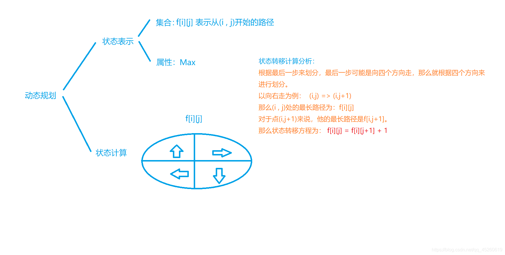

## 背包问题

01背包和完全背包

```cpp
01背包：f[i,j] = Max(f[i-1,j],f[i-1,j-v]+w)
完全背包：f[i,j] = Max(f[i-1,j],f[i,j-v]+w)
```

二位数组时两者基本相同

m是体积V，n是物品的个数

```cpp
for(int i = 1;i<n; i++){
	for(int j = 0; j <= m; j++){
        f[i][j] = f[i-1][j];
        if(j >= v[i]) f[i][j] = max(f[i][j],f[i-1][j-v[i]]+w[i]);
        //f[i][j] = max(f[i][j],f[i,j-v[i]]+w[i]);
    }
}
```

滚动数组时  两者的区别在于 01背包要从后往前遍历，完全背包要从前往后遍历

01背包

```c++
int f[N];
for(int i = 1; i <= n; i++){
    for(int j = m; j>=v[i]; j--)
        f[j] = max(f[j],f[j-v[i]]+w[i]);
}
cout<<f[m]<<endl;
```

完全背包

```c++
int f[N];
for(int i = 1; i <= n; i++){
    for(int j = v[i]; j <=m; j++){
        f[j]= max(f[j],f[j-v[i]]+w[i]);
    }
}
cout<<f[m]<<endl;
```

## 线性dp

- 数字三角形

  [898. 数字三角形 - AcWing题库](https://www.acwing.com/problem/content/description/900/)

  状态表示：

   - 集合：所有从起点走到(i,j)的路径
   - 属性：最大值 最小值

  状态计算：f[i,j] 来自 f[i-1,j] f[i,j-1]  f[i-1,j-1]  的最值+a[i,j]

  **计算时，下标涉及到i-1,i一般从1开始**

**从上往下走的话只有向下或向右下两种情况。首先试一试从上往下，会发现到了最后一行需要再进行一次比较，选出n个数中最大的那个，但如果我们从下往上走，可以知道最后的那个数一定是最大值。计算的方法就是依次选择符合条件的两个值中较大的那个，让后累加。**

```c++
int main(){
    int n;
    cin>>n;
    
    for(int i =1; i <= n; i++){
        for(int j = 1; j <= i; j++)
            cin>>w[i][j];
    }
    
    for(int i =1; i <= n; i++) f[n][i] = w[n][i];
    
    for(int i = n - 1; i > 0; i--){
        for(int j = 1; j <= i; j++)
            f[i][j] = max(f[i+1][j],f[i+1][j+1]) + w[i][j];
    }
    cout<<f[1][1]<<endl;
    return 0;
    
}
```


- 最长子序列  （包括打印子序列的元素）

  [895. 最长上升子序列 - AcWing题库](https://www.acwing.com/problem/content/897/)

  [896. 最长上升子序列 II - AcWing题库](https://www.acwing.com/problem/content/description/898/)

  [926. 将字符串翻转到单调递增 - 力扣（LeetCode） (leetcode-cn.com)](https://leetcode-cn.com/problems/flip-string-to-monotone-increasing/)

  **当需要记录路径的时候**    **多看看，不太理解**

  ```c++
  int main(){
      cin>>n;
      for(int i =1; i <= n;i++) {
          cin>>a[i];
          f[i] = 1;
          g[i] = 0;
      }
      
      for(int i = 1; i <= n; i++){
          for(int j = 1; j < i; j++){
              if(a[j]<a[i]){
                  if(f[i] < f[j]+1){
                      f[i] = f[j] + 1;
                      g[i] = j;
                  }
              }
          }
      }
      
      int k = 1;
      for(int i = 1; i <= n; i++){
          if(f[k] < f[i])
              k = i;
      }
      
      cout<<f[k]<<endl;
      
      for(int i = 0, len = f[k];i < len; i++){
          cout<<a[k]<<endl;
          k = g[k];
      }
      return 0;
  }
  ```

  

  >
  >
  >dp方法
  >
  >状态表示
  >
  > - 集合：所有以第i个数结尾的上升子序列
  > - 属性  最值
  >
  >状态计算 
  >
  >```cpp
  >for(int i =1; i <= n;i++) {
  >      cin>>a[i];
  >      f[i] = 1;
  >}
  >for(int i=1; i<=n; i++)
  >    for(int j=1; j<i; j++)
  >        if(a[j] < a[i])
  >            f[i] = max(f[i], f[j]+1);
  >for(int i=1; i<=n; i++) 
  >    ans = max(ans, f[i]);
  >```

  >dp+二分
  >
  >维护一个数组vec,vec[i]表示 长度为 i+1的LIS的 **最小**的终点
  >
  >**长度相同的LIS只存终点的最小值。**
  >
  >**随着LIS长度的增加，其结尾的值（最小的那个）一定是单调递增的**
  >
  >**lower_bound 函数，查找nums[i] ，返回大于等于nums[i]的第一个位置**
  >
  >```c++
  >vector<int> vec;
  >
  >        for(int i=0;i<n;i++)
  >        {
  >            int p=lower_bound(vec.begin(),vec.end(),nums[i])-vec.begin();//二分查找，返回大于等于nums[i]的第一个位置
  >            if(p==vec.size())//添加进来
  >                vec.push_back(nums[i]);
  >            else
  >                vec[p]=nums[i];//替换掉
  >        }
  >
  >```
  >
  >最后得到的vec中存放是路径

- 最长的公共子序列

  [897. 最长公共子序列 - AcWing题库](https://www.acwing.com/problem/content/899/)

  状态表示

  	- 集合 所有在第一个序列的前i个字母中出现，且在第二个序列的前j个字母中出现的子序列
  	- 属性  max

  状态计算

   f[i,j] = max(f[i-1.j],f[i,j-1])

  if(s[i] == t[j]) : f[i,j] = max(f[i,j],f[i-1,j-1] + 1)

```c++
 for(int i = 1;i <= n; i++){
        for(int j = 1; j <= m; j++){
            f[i][j] = max(f[i-1][j], f[i][j-1]);
            if(a[i] == b[j]) f[i][j] = max(f[i][j], f[i-1][j-1]+1);
        }
    }    
    cout<<f[n][m]<<endl;
```


- 编辑距离 和上面的相似

[899. 编辑距离 - AcWing题库](https://www.acwing.com/problem/content/901/)

## 区间dp

石子合并

[282. 石子合并 - AcWing题库](https://www.acwing.com/problem/content/284/)

状态表示f[i,j]   f(l,r)表示第l堆到第r堆合并的最小代价

	- 集合：所有将第i堆石子到第j堆石子合并到一起的合并方式
	- 属性   min

状态计算  最后的解  f[1,n]

要求f(l,r)表示第l堆到第r堆的最小值，那么就可以把这个区间划分两份。

设k,l<k<r,那么分别求出f(l,k)和f(k+1,r)的最小值，不就可以求得f(l,r)

得状态表达式具体为：f(l,r)=min( f(l,r) ,f(l,k)+f(k,r) + sum(l,r));

其中sum(l,r)表示第i堆到第j堆之和，要从f(l,k)和f(k+1,r)合并成f(l,r)产生的合并代价就是sum(l,r)


```cpp
#include<iostream>
#include<algorithm>
#define INF 1e9
using namespace std;
const int N= 310;
int n;
int f[N][N];
int w[N],s[N];
int main()
{
    cin>>n;
    for(int i=1;i<=n;i++)cin>>w[i],s[i]=w[i]+s[i-1];
    
    for(int len=2;len<=n;len++)
    {
        for(int l=1;l+len-1<=n;l++)
        {
            int r=l+len-1;
            f[l][r]=INF;
            for(int k=l;k<r;k++)
            {
                f[l][r]=min(f[l][r],f[l][k]+f[k+1][r]+s[r]-s[l-1]);
            }
        }
    }
    cout<<f[1][n]<<endl;
    return 0;
}
```


## 树形dp

[285. 没有上司的舞会 - AcWing题库](https://www.acwing.com/problem/content/287/)

状态表示
f [u,0]：所有以u为根的子树中选择，并且不选u这个点的方案

f[u,1]：所有以u为根的子树中选择，并且选u这个点的方案

属性：Max

状态计算
当前u结点不选，子结点可选可不选

f[u,0]=∑max(f[si,0],f[si,1])
当前u结点选，子结点一定不能选

f[u,1]=∑(f[si,0])

```c++
//f[u][0]代表不选u这个节点得到的最大快乐指数 
//f[u][1]代表选u这个节点得到的最大快乐指数
#include<bits/stdc++.h>
using namespace std;
const int N=6010;
vector<vector<int> >v(6010); //建立树重要
int happy[N];
int f[N][2];
bool st[N];
void dfs(int u){
    f[u][1]=happy[u];
    for(int i=0;i<v[u].size();i++){
        int j=v[u][i];
        dfs(j); //先递归出下面的结果
        f[u][0]+=max(f[j][1],f[j][0]);
        f[u][1]+=f[j][0];
    }
}
int main(){
    int n;
    cin>>n;
    for(int i=1;i<=n;i++)cin>>happy[i];
     for(int i=0;i<n-1;i++){
        int a,b;
        scanf("%d%d",&a,&b);
        v[b].push_back(a);
        st[a]=true;
    }
    int root=1;
    while(st[root]==true)root++;
    dfs(root);
    printf("%d\n",max(f[root][0],f[root][1]));
    
}
```

## 记忆化搜索

[901. 滑雪 - AcWing题库](https://www.acwing.com/problem/content/903/)

**定义一个数组 **f[i] [j] 用以记录 dfs(i, j) 的返回值**，每次递归时先判断 f[i] [j] 是否已经有返回值，如果没有则继续执行，如果有则直接跳过。**

**记忆化搜索是一种以递归 / 搜索形式实现的动态规划**，

记忆化搜索与递归一样，都是自顶向下的思路，而动态规划则是自底向上的思路。
在平常练习中，我们一般是只考虑一个问题，一般习惯于自顶向下正向思考，这也比较符合人类的逻辑习惯嘛，这便是记忆化搜索（ms）。如果逆向思考，自底向上递推求解，这便是动态规划（dp）了。



```c++
#include<bits/stdc++.h>
using namespace std;
const int N = 301;
int h[N][N];
int f[N][N];
int m,n;

int dx[4] = {-1,0,1,0},dy[4] = {0,1,0,-1};
int dp(int x, int y){
    int &v = f[x][y];   //v等价于f[x][y]，共用同一块内存
    if(v != -1) return v;//说明该情况已经计算过了，
    
    v = 1;
    for(int i = 0; i < 4; i++){
        int a = x+dx[i],b= y+dy[i];
        if(a >= 1&&a<=m&&b>=1&&b<=n&&h[a][b]<h[x][y])
            v= max(v,dp(a,b)+1);  //这里还要给v赋值，时刻更新，保证v的值是最大的
    }
    return v;
}

int main(){
    cin>>m>>n;
    
    for(int i = 1; i <= m; i++){
        for(int j = 1; j <= n; j++)
            cin>>h[i][j];
    }
    
    memset(f, -1, sizeof f);//给数组f初始化为-1，f[i][j]==-1时表示该点还未进行处理"
    int res =0;
    for(int i = 1; i <= m; i++){
        for(int j = 1; j <= n; j++){
            res = max(res,dp(i,j));
        }
    }
    cout<<res<<endl;
    return 0;
}
```

