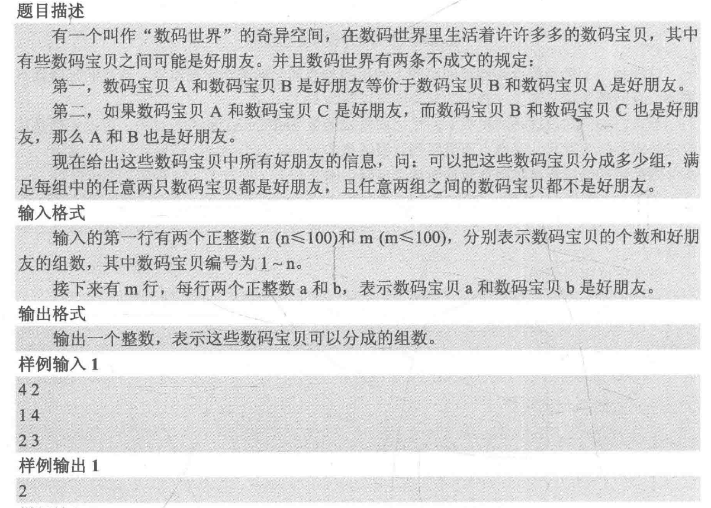

# 并查集

**合并两个集合； 判断两个元素是否在一个集合**

基本原理：每个集合用一颗树表示，根节点的编号就是整个集合的编号每个节点存储它的父节点，p[x]表示x的父节点

[836. 合并集合 - AcWing题库](https://www.acwing.com/problem/content/838/)

[837. 连通块中点的数量 - AcWing题库](https://www.acwing.com/problem/content/839/)

[AcWing 240. 食物链---数组d的真正含义以及find()函数调用过程 - AcWing](https://www.acwing.com/solution/content/15938/)

```c++
(1)朴素并查集：
    int p[N]; //存储每个点的祖宗节点

    // 返回x的祖宗节点  + 路径压缩
    int find(int x)
    {
        if (p[x] != x) p[x] = find(p[x]); //记住这个表达
        return p[x];
    }

    // 初始化，假定节点编号是1~n
    for (int i = 1; i <= n; i ++ ) p[i] = i;

    // 合并a和b所在的两个集合：
    p[find(a)] = find(b);

2)维护size的并查集：

    int p[N], cnt[N];
    //p[]存储每个点的祖宗节点, size[]只有祖宗节点的有意义，表示祖宗节点所在集合中的点的数量

    // 返回x的祖宗节点
    int find(int x)
    {
        if (p[x] != x) p[x] = find(p[x]);
        return p[x];
    }

    // 初始化，假定节点编号是1~n
    for (int i = 1; i <= n; i ++ )
    {
        p[i] = i;
        cnt[i] = 1;
    }

    // 合并a和b所在的两个集合：
	if(find(a) == find(b)) continue;
    cnt[find(b)] += cnt[find(a)];
    p[find(a)] = find(b);

	//输出a所在的集合的数量
	cout<<cnt[find(a)]<<endl;

(3)维护到祖宗节点距离的并查集：
    int p[N], d[N];
    //p[]存储每个点的祖宗节点, d[x]存储x到p[x]的距离

    // 返回x的祖宗节点
    int find(int x)
    {
        if (p[x] != x)
        {
            int u = find(p[x]);
            d[x] += d[p[x]];
            p[x] = u;
        }
        return p[x];
    }

    // 初始化，假定节点编号是1~n
    for (int i = 1; i <= n; i ++ )
    {
        p[i] = i;
        d[i] = 0;
    }

    // 合并a和b所在的两个集合：
    p[find(a)] = find(b);
    d[find(a)] = distance; // 根据具体问题，初始化find(a)的偏移量

```


2. 题目




- 解析：

  将题目中的“组”视为集合，好朋友关系是为两个节点之间的边，输入时既可以进行并查集的合并操作

  开一个bool数组来记录每个节点是否作为某个集合的根节点，当处理完输入数据之后就可以遍历所有元素，令它们在集合的根节点的flag设为true，最后累加flag数组中的元素。

```CPP
/*
 * @Author: yaodaoteng
 * @Date: 2021-05-19 21:46:07
 * @LastEditors: yaodaoteng
 * @LastEditTime: 2021-05-19 21:56:56
 * @FilePath: \vscode\bingchaji.cpp
 */

#include<cstdio>
using namespace std;

const int N = 110;
int father[N];//存放父亲节点
bool isRoot[N]; //记录每个节点是否是某个集合的根节点

int findFather(int x){  //查找x所在集合的根节点
    int a = x;
    while(x != father[x])
        x = father[x];

    //路径压缩
    while(a != father[a]){
        int z = a;
        a = father[a];
        father[z] = x;
    }
    return x;
}

void Union(int a, int b){
    int faA = findFather(a);
    int faB = findFather(b);
    if(faA != faB)
        father[faA] = faB;
}

void init(int n){//初始化father[i]为i，且flag[i] 为false
    for (int i = 1; i <= n; i++){
        father[i] = i;
        isRoot[i] = false;
    }
}

int main(){
    int n, m, a, b;
    scanf("%d%d", &n, &m);
    init(n);
    for (int i = 0; i < m; i++){
        scanf("%d%d", &a, &b);//输入两个好朋友的关系
        Union(a, b);//合并a和b所在的集合
    }
    for (int i = 1; i <= n; i++){
        isRoot[findFather(i)] = true;//i的根节点是findFather(i)

    }
    int ans = 0; //记录集合数目
    for (int i = 1; i <= n; i++)
        ans += isRoot[i];

    printf("%d\n", ans);
    return 0;
}

```

